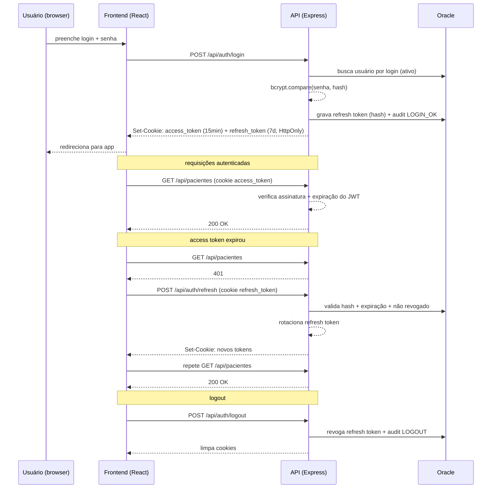

# Plano de Implementação — Autenticação e Segurança de Login (V.E.R)

> Status: **implementado (backend + frontend + SQL). Falta você executar o SQL e o seed.**
> Data: 2026-10-05 (implementação em 2026-10-06)

---

## 1. Objetivo

Adicionar ao sistema V.E.R um mecanismo de autenticação e controle de acesso com:

- Login por usuário/senha;
- Token **JWT** (access token) de curta duração;
- **Refresh token** de longa duração, revogável, persistido no banco;
- Expiração controlada de sessão;
- Proteção das rotas existentes (`/api/pacientes`, `/api/atendimentos`, `/api/anexos`);
- **RBAC** (papéis/perfis) para restringir ações sensíveis (ex.: bloquear/ativar exame);
- Auditoria de logins (LGPD).

---

## 2. Decisões de arquitetura (recomendações)

| Decisão | Recomendação | Justificativa |
|---|---|---|
| Armazenamento do token no cliente | **Cookie `HttpOnly`** (não `localStorage`) | `localStorage` é lido por qualquer JS; se houver XSS, o token é roubado. Cookie `HttpOnly` não é acessível via `document.cookie`. |
| Estratégia de tokens | **Access token (JWT) + Refresh token opaco** | Access curto (15 min) limita dano se vazado; refresh permite renovar sem re-login e pode ser **revogado** no banco (logout/bloqueio imediato). |
| Refresh token | **Opaque** (`crypto.randomBytes(48)`), armazenado **somente o hash** (SHA-256) no banco | Se o banco vazar, ninguém obtém os tokens válidos. Permite **rotação** a cada refresh. |
| Hash de senha | **bcrypt** (custo 12) — alternativa: argon2id | Padrão da indústria, lento por design, resistente a força bruta. Hash é calculado no Node (Oracle não tem bcrypt nativo). |
| Expiração da sessão | Access: **15 min** / Refresh: **1 dia** (renovável por atividade) | Escolha do time: sessão diária. |
| Sessão múltipla | Permitir (1 registro por refresh emitido) + opção "sair de todos" | Fácil revogar tudo por usuário. |
| CSRF | `SameSite=Strict` + header custom (`X-Requested-With`) + CORS restrito | Com cookie, requests de estado precisam de proteção. |
| Transporte | HTTPS obrigatório em produção (`Secure`) | Cookies de autenticação nunca trafegam em texto claro. |
| CORS | Restrito à origem do front (com `credentials: true`) | Hoje está `cors()` aberto para qualquer origem. |
| Headers de segurança | `helmet` | Mitiga sniffing, clickjacking etc. |
| Rate limiting | `express-rate-limit` no `/api/auth/login` | Mitiga força bruta. |

> **Decisão em aberto (ver seção 10):** reaproveitar uma tabela de usuários já existente no Oracle (sistema legado MV) ou criar tabela nova. O plano abaixo assume **tabela nova** (`APP_USUARIOS`) — é o caminho mais seguro e desacoplado.

---

## 3. Fluxo de autenticação



---

## 4. Estrutura de arquivos proposta

### Backend (`ver-api/src`)

```
ver-api/src/
├── app.ts                          # adicionar helmet, cors restrito, rotas /api/auth
├── server.ts                       # (sem mudança relevante)
├── modules/
│   ├── auth/
│   │   ├── auth.routes.ts          # POST login, refresh, logout; GET me
│   │   ├── auth.controller.ts
│   │   ├── auth.service.ts         # lógica de login/refresh/revogação
│   │   ├── auth.repository.ts      # queries em APP_USUARIOS, AUTH_SESSOES, AUTH_LOGS
│   │   └── auth.types.ts
│   └── ... (pacientes, atendimentos, anexos — recebem middleware)
└── shared/
    ├── database/OracleConnection.ts  # (existente)
    ├── security/
    │   ├── jwt.ts                  # assinar/verificar access token
    │   ├── password.ts             # bcrypt hash/compare
    │   └── token.ts                # gerar/hash/verificar refresh token
    └── middlewares/
        ├── auth.middleware.ts      # exige JWT válido
        ├── rbac.middleware.ts      # exige perfil (ex.: requireRole('ADMIN'))
        ├── rateLimiter.ts          # limite no login
        └── errorHandler.ts         # erros padronizados
```

### Frontend (`ver-frontend/src`)

```
ver-frontend/src/
├── App.tsx                         # envolver com AuthProvider + rotas/guard
├── shared/
│   ├── services/api.ts             # adicionar credentials:'include' + interceptor 401
│   └── auth/
│       ├── AuthContext.tsx         # estado user/isAuthenticated
│       ├── auth.service.ts         # login/logout/refresh/me
│       └── ProtectedRoute.tsx      # redireciona para /login
├── modules/
│   └── auth/
│       └── pages/Login/Login.tsx   # tela de login
```

---

## 5. Modelagem do banco de dados (Oracle)

Usar **sequências** (padrão já adotado no projeto, ex.: `seq_anexos_exames`).

```sql
-- ============ SEQUÊNCIAS ============
CREATE SEQUENCE seq_app_usuarios START WITH 1 INCREMENT BY 1 NOCACHE;
CREATE SEQUENCE seq_auth_sessoes START WITH 1 INCREMENT BY 1 NOCACHE;
CREATE SEQUENCE seq_auth_logs    START WITH 1 INCREMENT BY 1 NOCACHE;

-- ============ USUÁRIOS ============
CREATE TABLE app_usuarios (
    id            NUMBER        NOT NULL,
    login         VARCHAR2(50)  NOT NULL,
    senha_hash    VARCHAR2(100) NOT NULL,          -- hash bcrypt (60 chars) + folga
    nome          VARCHAR2(120),
    email         VARCHAR2(120),
    perfil        VARCHAR2(30)  NOT NULL,          -- ADMIN | OPERADOR | VISUALIZADOR
    situacao      CHAR(1)       DEFAULT 'A' NOT NULL, -- A=ativo, B=bloqueado
    ultimo_login  DATE,
    criado_em     DATE          DEFAULT SYSDATE NOT NULL,
    atualizado_em DATE          DEFAULT SYSDATE NOT NULL,
    CONSTRAINT pk_app_usuarios PRIMARY KEY (id),
    CONSTRAINT uq_app_usuarios_login UNIQUE (login),
    CONSTRAINT ck_app_usuarios_situacao CHECK (situacao IN ('A','B'))
);

-- ============ SESSÕES (REFRESH TOKENS) ============
CREATE TABLE auth_sessoes (
    id                  NUMBER         NOT NULL,
    usuario_id          NUMBER         NOT NULL,
    refresh_token_hash  VARCHAR2(200)  NOT NULL,  -- SHA-256 hex (64 chars)
    expira_em           DATE           NOT NULL,
    revogada            CHAR(1)        DEFAULT 'N' NOT NULL, -- S/N
    ip                  VARCHAR2(45),
    user_agent          VARCHAR2(400),
    criado_em           DATE           DEFAULT SYSDATE NOT NULL,
    CONSTRAINT pk_auth_sessoes PRIMARY KEY (id),
    CONSTRAINT fk_auth_sessoes_usuario FOREIGN KEY (usuario_id)
        REFERENCES app_usuarios (id),
    CONSTRAINT ck_auth_sessoes_revogada CHECK (revogada IN ('S','N'))
);
CREATE INDEX ix_auth_sessoes_usuario ON auth_sessoes (usuario_id);
CREATE INDEX ix_auth_sessoes_token   ON auth_sessoes (refresh_token_hash);

-- ============ AUDITORIA ============
CREATE TABLE auth_logs (
    id         NUMBER        NOT NULL,
    usuario_id NUMBER,
    acao       VARCHAR2(50)  NOT NULL,   -- LOGIN_OK | LOGIN_FALHA | LOGOUT | REFRESH ACESSO_NEGADO
    detalhe    VARCHAR2(400),
    ip         VARCHAR2(45),
    user_agent VARCHAR2(400),
    criado_em  DATE          DEFAULT SYSDATE NOT NULL,
    CONSTRAINT pk_auth_logs PRIMARY KEY (id)
);
CREATE INDEX ix_auth_logs_usuario ON auth_logs (usuario_id);
CREATE INDEX ix_auth_logs_data    ON auth_logs (criado_em);
```

### Perfis (RBAC) sugeridos

| Perfil | Acessa | Restrições |
|---|---|---|
| `ADMIN` | Tudo | Gerenciar usuários, desbloquear, auditoria |
| `OPERADOR` | Pacientes, atendimentos, upload, visualização | Bloquear/ativar exame? (a definir) |
| `VISUALIZADOR` | Somente leitura (visualizar/baixar exames) | Sem upload, sem bloqueio |

### Seed inicial

Criar 1 usuário `admin` com senha temporária (a ser trocada no primeiro login, se desejado). O hash bcrypt é gerado pelo Node, não via SQL puro.

---

## 6. Configuração e variáveis de ambiente

Adicionar ao `.env` do `ver-api` (arquivo **não versionado**):

```env
# JWT
JWT_SECRET=<chave aleatória de 256 bits (64 chars hex)>
JWT_ACCESS_EXPIRES=15m

# Refresh token
REFRESH_TOKEN_TTL_DAYS=1

# Cookie
COOKIE_SECURE=false          # true em produção (HTTPS)
COOKIE_SAME_SITE=strict

# CORS
CORS_ORIGIN=http://localhost:5173
```

> Gerar `JWT_SECRET` com: `node -e "console.log(require('crypto').randomBytes(32).toString('hex'))"`

---

## 7. Endpoints da API

| Método | Rota | Descrição | Proteção |
|---|---|---|---|
| `POST` | `/api/auth/login` | Autentica, emite access + refresh (Set-Cookie) | rate limit |
| `POST` | `/api/auth/refresh` | Rotaciona refresh token e emite novo access | cookie refresh |
| `POST` | `/api/auth/logout` | Revoga refresh token, limpa cookies | cookie refresh |
| `GET`  | `/api/auth/me` | Retorna usuário logado (id, login, nome, perfil) | JWT |
| `POST` | `/api/auth/logout-all` | Revoga todas as sessões do usuário | JWT |

### Proteção das rotas existentes

- `GET /api/pacientes` → `authMiddleware`
- `GET /api/atendimentos` → `authMiddleware`
- `GET /api/anexos/exames` → `authMiddleware`
- `POST /api/anexos/upload` → `authMiddleware` (+ `requireRole('ADMIN','OPERADOR')`)
- `GET /api/anexos/view/:id` → `authMiddleware` (ou URL assinada, ver seção 9)
- `PATCH /api/anexos/status/:id` → `authMiddleware` + `requireRole('ADMIN','OPERADOR')`

---

## 8. Detalhes de segurança (hardening)

1. **Senhas**: nunca logar senha/hash; bcrypt cost 12; exigir mínimo de 8 caracteres.
2. **JWT**: assinatura HS256; claims `sub` (id), `login`, `perfil`, `iat`, `exp`, `jti`; validar `exp`, `iat` e assinatura.
3. **Refresh token**: opaque, armazenar apenas SHA-256; **rotação** a cada uso; **detecção de reuso** (se um refresh já revogado for reapresentado, revogar todas as sessões do usuário).
4. **Cookies**: `HttpOnly`, `Secure` (prod), `SameSite=Strict`, `Path=/api/auth` (o refresh só precisa ir ao `/auth`).
5. **CSRF**: `SameSite=Strict` + exigir header `X-Requested-With: XMLHttpRequest` em POST/PATCH (front envia). CORS restrito à origem.
6. **CORS**: substituir `cors()` por `cors({ origin: CORS_ORIGIN, credentials: true })`.
7. **helmet**: ativar com configuração segura.
8. **Rate limit**: `express-rate-limit` — ex.: 5 tentativas/min por IP no login (com bloqueio progressivo opcional).
9. **Bloqueio de conta**: após N falhas (ex.: 5), marcar `situacao='B'` e registrar em `auth_logs`.
10. **Auditoria (LGPD)**: registrar login ok/falha, logout, refresh, acesso negado com IP e user-agent.
11. **Segredos**: manter `.env` fora do git; rotacionar `JWT_SECRET` periodicamente.

---

## 9. Ponto de atenção: `GET /api/anexos/view/:id`

Hoje essa rota serve o arquivo por `res.sendFile`. Ela será protegida por cookie, mas **iframes** e links de download com cookie `SameSite=Strict` funcionam bem quando o front e a API estão na mesma origem. Por isso, recomendamos:

- Em **desenvolvimento**: configurar **proxy do Vite** (`/api` → `http://localhost:3000`) para que front e API sejam same-origin (elimina CORS e problemas de cookie).
- Em **produção**: servir o front e a API no mesmo domínio (ex.: Nginx).

Alternativa (se for necessário abrir o PDF em aba separada sem cookie): **URL assinada** (token curto via query param, assinado com o `JWT_SECRET`, expira em ~60s). Decidir na revisão.

---

## 10. Fases de implementação

> Nada será codado antes da sua aprovação deste plano.

| Fase | Atividade | Entregável |
|---|---|---|
| **0** | Aprovar decisões (seção 2 + questões abertas) | plano final |
| **1** | Script DDL + sequências + seed admin (arquivo `db/auth.sql`) | banco criado |
| **2** | `shared/security` (jwt, password, token) + testes unitários | helpers seguros |
| **3** | Módulo `auth` (routes/controller/service/repository) + `/login`, `/refresh`, `/logout`, `/me` | API de auth |
| **4** | Middlewares (`auth`, `rbac`, `rateLimiter`, `errorHandler`) + helmet + CORS restrito | base de proteção |
| **5** | Proteger rotas existentes (pacientes, atendimentos, anexos) | API protegida |
| **6** | Frontend: `AuthContext`, `Login`, `ProtectedRoute`, `auth.service`, interceptor no `api.ts` | login na UI |
| **7** | Auditoria completa + testes de integração | logs LGPD + cobertura |
| **8** | Hardening final + revisão de segurança | pronto p/ produção |

---

## 11. Testes previstos

- **Unitários**: `jwt.ts` (assinar/verificar/expirado), `password.ts` (hash/compare), `token.ts` (gerar/hash), `auth.service.ts` (login inválido, usuário bloqueado, refresh reuso).
- **Integração**: login → rotas protegidas 200/401; refresh → novo access; logout → refresh revogado.
- **Frontend**: `Login` renderiza e chama serviço; `ProtectedRoute` redireciona sem token.

---

## 12. Decisões confirmadas

1. **Origem dos usuários** → ✅ criar tabela nova (`APP_USUARIOS`).
2. **Perfis** → ✅ `ADMIN`, `OPERADOR`, `VISUALIZADOR`.
3. **Hash** → ✅ bcrypt (custo 12).
4. **Duração do refresh** → ✅ 1 dia (renovável por atividade).
5. **`/anexos/view`** → ✅ same-origin via proxy do Vite (dev) / mesmo domínio (prod).
