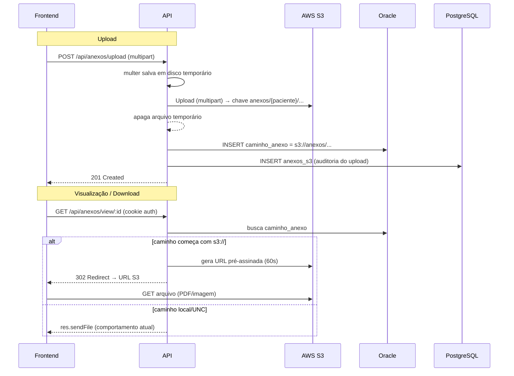

# Plano de Implementação — Armazenamento de Anexos no AWS S3 (V.E.R)

> Status: **implementado (2026-10-07).** Aplique o SQL + migração antes de usar.
> Data: 2026-10-07

---

## 1. Objetivo

Trocar o armazenamento atual dos exames (disco local / caminho UNC `\\192.168.4.18\C$...`) por **Amazon S3**, mantendo compatibilidade com os anexos já existentes.

---

## 2. Decisões de arquitetura (recomendações)

| Decisão | Recomendação | Justificativa |
|---|---|---|
| Abstração de storage | Interface `StorageService` com drivers `Local` e `S3` | Troca por configuração (`STORAGE_DRIVER`), sem reescrever o fluxo. |
| SDK | AWS SDK v3 (`@aws-sdk/client-s3`, `lib-storage`, `s3-request-presigner`) | SDK moderno e modular. |
| Credenciais | Variáveis de ambiente (`AWS_ACCESS_KEY_ID`, `AWS_SECRET_ACCESS_KEY`, `AWS_REGION`) | Funciona no Docker/local; em ECS/EC2 pode usar IAM Role (cadeia padrão do SDK). |
| Upload | `multer` em disco temporário → `Upload` (multipart) para o S3 → apaga o temporário | Evita carregar arquivos grandes na memória. |
| Nome/chave no S3 | `anexos/{cd_paciente}/{cd_paciente}-{cd_atendimento}-{tipoExame}-{data}.{ext}` | Organiza por paciente e mantém o padrão de nome atual. |
| O que gravar no banco | `caminho_anexo` passa a guardar `s3://anexos/...` (chave do objeto) | Sem mudança de schema; permite detectar o driver por prefixo. |
| Visualização | `GET /api/anexos/view/:id` → **redirect 302** para URL pré-assinada (GET) | Iframe e `window.open` continuam funcionando sem mudar o frontend. |
| Download | Novo `GET /api/anexos/download/:id` → URL pré-assinada com `Content-Disposition: attachment` | Baixa com o nome original do arquivo. |
| URL pré-assinada | Expiração curta (ex.: **60 s**) | Limita o risco de vazamento do link. |
| Bucket | **Privado** (sem acesso público); SSE-S3 habilitado | Segurança dos dados de saúde (LGPD). |
| Auditoria no PostgreSQL | Tabela `anexos_s3` registra cada upload (atendimento, exame, usuário, data, bucket/chave, status) | Rastreabilidade (LGPD) sem poluir o Oracle. |
| Compatibilidade | Registros antigos (caminho UNC/local) continuam servidos pelo driver Local | Nenhum exame existente quebra. |
| Distribuição dos dados | **Oracle**: somente leitura (atendimentos/pacientes/procedimentos). **PostgreSQL**: `exames`, `anexo_exames`, `anexos_s3` | Consolida anexos no Postgres; Oracle fica só para consulta. |

---

## 3. Fluxo (upload e visualização)



---

## 4. Estrutura de arquivos proposta

```
ver-api/src/
├── shared/
│   └── storage/
│       ├── storage.types.ts          # interface StorageService + resultado
│       ├── local.storage.ts          # driver atual (disco/UNC)
│       ├── s3.storage.ts             # driver S3 (upload + presign)
│       └── index.ts                  # factory getStorage() por STORAGE_DRIVER
└── modules/anexos/
    ├── anexo.service.ts              # usa getStorage() em vez de fs-extra direto
    ├── anexo.controller.ts           # view/download → redirect ou sendFile
    ├── anexo.routes.ts               # (sem mudanças estruturais)
    └── anexo-postgres.repository.ts  # grava anexo_exames + anexos_s3 no PostgreSQL

infra/postgres/init/
    ├── 01_auth_schema.sql            # (existente)
    └── 02_anexos.sql                 # tabelas anexo_exames + anexos_s3
```

---

## 5. Configuração (`.env`)

```env
# Driver de armazenamento: local | s3
STORAGE_DRIVER=s3

# AWS S3
AWS_REGION=sa-east-1
AWS_ACCESS_KEY_ID=...
AWS_SECRET_ACCESS_KEY=...
S3_BUCKET=ver-anexos

# Tempo de vida da URL pré-assinada (segundos)
S3_PRESIGN_TTL=60
```

> No `docker-compose.yml`, essas variáveis são repassadas ao serviço `api` (como as demais). Credenciais ficam apenas no `.env` (não versionado).

---

## 6. Mudanças no código

### 6.1 Interface de storage (`storage.types.ts`)

```ts
export interface StorageService {
  /** Salva o arquivo e retorna o identificador (path local ou s3://chave). */
  save(file: Express.Multer.File, destino: string): Promise<string>;
  /** Retorna o caminho local do arquivo (driver local) ou URL pré-assinada (driver S3). */
  resolve(caminho: string, opcoes?: { download?: boolean }): Promise<{ kind: 'file' | 'url'; value: string }>;
  /** Remove um arquivo (usado ao excluir/reprocessar). */
  remove(caminho: string): Promise<void>;
}
```

### 6.2 Driver Local (`local.storage.ts`)
- É o comportamento atual: `fs-extra` (move + `ensureDir`) e `sendFile`.

### 6.3 Driver S3 (`s3.storage.ts`)
- `save`: `new Upload({ client, params: { Bucket, Key, Body: fs.createReadStream(file.path) } })`.
- `resolve`: `getSignedUrl(client, new GetObjectCommand({ Bucket, Key, ResponseContentDisposition? }), { expiresIn })`.
- Usa o `S3Client` criado uma vez (singleton, como os demais pools).

### 6.4 `anexo.service.ts` + `anexo.repository.ts`
- O repositório de anexos passa a usar o **PostgreSQL** (`exames` e `anexo_exames`), em vez do Oracle.
- `listExames`/`getExameById` leem a tabela `exames` do Postgres.
- O salvamento grava em `anexo_exames` (Postgres) + `anexos_s3` (auditoria), usando `getStorage().save(...)` para o arquivo (`s3://...` no S3).

### 6.5 `anexo.controller.ts`
- `view`: chama `storage.resolve(caminho)` → se `kind === 'url'`, `res.redirect(url)`; senão `res.sendFile(value)`.
- Novo `download`: igual, mas com `download: true` (anexa `Content-Disposition`).

### 6.6 Frontend
- **Sem mudanças obrigatórias** (o iframe já aponta para `/api/anexos/view/:id`, que passará a redirecionar).
- Opcional: botão "Download" usar `/api/anexos/download/:id`.

### 6.7 Registros de anexos no PostgreSQL

Duas tabelas no PostgreSQL passam a ser a fonte dos **novos** anexos (S3):

**`anexo_exames`** — registro mestre do anexo (o `id` dessa tabela é o que referencia o salvamento):

```sql
CREATE TABLE anexo_exames (
    id             BIGSERIAL PRIMARY KEY,
    cd_paciente    INTEGER      NOT NULL,
    cd_atendimento INTEGER      NOT NULL,
    id_exame       INTEGER      NOT NULL,   -- tipo de exame (exames.id do Oracle)
    tipo_exame     VARCHAR(200),            -- descrição do exame
    olho           VARCHAR(10),             -- OD | OE | AO
    observacoes    TEXT,
    nome_arquivo   VARCHAR(255) NOT NULL,   -- nome original do arquivo
    content_type   VARCHAR(100),
    tamanho_bytes  BIGINT,
    bucket         VARCHAR(120) NOT NULL,
    s3_key         VARCHAR(500) NOT NULL,
    statusdoc      CHAR(1)      NOT NULL DEFAULT 'A',  -- A | B (ativo/bloqueado)
    usuario_id     BIGINT       NOT NULL REFERENCES app_usuarios (id),
    criado_em      TIMESTAMPTZ  NOT NULL DEFAULT now()
);
CREATE INDEX ix_anexo_exames_atendimento ON anexo_exames (cd_atendimento);
CREATE INDEX ix_anexo_exames_paciente    ON anexo_exames (cd_paciente);
```

**`anexos_s3`** — auditoria do salvamento no S3 (referencia o id da nova `anexo_exames`):

```sql
CREATE TABLE anexos_s3 (
    id            BIGSERIAL PRIMARY KEY,
    anexo_id      BIGINT      NOT NULL REFERENCES anexo_exames (id),
    status        VARCHAR(20) NOT NULL DEFAULT 'SUCESSO', -- SUCESSO | ERRO
    mensagem_erro TEXT,
    criado_em     TIMESTAMPTZ NOT NULL DEFAULT now()
);
CREATE INDEX ix_anexos_s3_anexo ON anexos_s3 (anexo_id);
```

Fluxo de gravação no upload S3:
1. Upload do arquivo para o S3.
2. `INSERT` em `anexo_exames` (retorna o novo `id`).
3. `INSERT` em `anexos_s3` com `anexo_id = anexo_exames.id` e `status` (SUCESSO/ERRO).

- `anexo-postgres.repository.ts` (usa `PostgresConnection`) com `criarAnexo(...)` e `registrarAuditoria(...)`.
- `anexo.service.ts` chama os dois após o salvamento, recebendo do controller o `usuario_id` (do `req.user`).

> **Impacto no Oracle:** os novos uploads passam a ser gravados no PostgreSQL. A tela de atendimentos (que hoje lê `anexos_exames` do Oracle via `LISTAGG`) precisa ser ajustada para buscar os anexos no PostgreSQL — ou manter **escrita dupla** (Oracle + PostgreSQL) durante a transição. *(a decidir)*

> Se o volume do Postgres já existir, o init script **não** roda sozinho. Aplique manualmente:
> `docker compose exec db psql -U ver -d ver -f /docker-entrypoint-initdb.d/02_anexos.sql`

---

## 7. Dependências novas

```bash
npm i @aws-sdk/client-s3 @aws-sdk/lib-storage @aws-sdk/s3-request-presigner
```

---

## 8. Migração de dados e compatibilidade

**Escopo:**
- **Oracle (somente leitura):** `atendime`, `paciente`, `procedimento_sus` — usados para listar atendimentos e pacientes.
- **PostgreSQL (escrita/leitura):** `exames` (tipos de exame), `anexo_exames` (registros de anexo), `anexos_s3` (auditoria).

**Migração inicial (script):**
1. `exames`: copiar os tipos de exame do Oracle → PostgreSQL.
2. `anexo_exames`: copiar os registros existentes (metadados: prontuário, atendimento, procedimento, olho, caminho, status, data, observações) do Oracle → PostgreSQL. Os **arquivos físicos antigos continuam onde estão** (servidor local/UNC) — apenas os metadados migram.

**Visualização:**
- Registros com `caminho_anexo` local/UNC → servidos pelo driver Local (`sendFile`).
- Registros com `s3://...` → URL pré-assinada (driver S3).

**Tela de atendimentos:**
- O `LISTAGG` deixa de ser feito no Oracle. A API passa a buscar os anexos no PostgreSQL (por `cd_atendimento`) e faz o merge com os atendimentos do Oracle.

---

## 9. Fases de implementação

| Fase | Atividade |
|---|---|
| 0 | Aprovar decisões (seção 2 + questões abertas) |
| 1 | Instalar SDK v3 + configurar `.env`/compose (`STORAGE_DRIVER`, AWS_*) |
| 2 | Criar `shared/storage/*` (interface + drivers Local e S3 + factory) |
| 3 | Refatorar `anexo.service.ts` e `anexo.controller.ts` (view/download) |
| 4 | Criar tabelas `anexo_exames` e `anexos_s3` (`02_anexos.sql`) + `anexo-postgres.repository.ts` + gravar no upload |
| 5 | Testes unitários dos drivers (mock do S3) e ajustes no `api.ts`/frontend se necessário |
| 6 | Validação manual: upload → view → download + conferir registro na `anexos_s3` |
| 7 | Documentação e commit |

---

## 10. Segurança (checklist)

- Bucket **privado**; acesso somente via API autenticada + URLs pré-assinadas.
- IAM de **menor privilégio**: `s3:PutObject` e `s3:GetObject` somente no prefixo `anexos/`.
- `SSE-S3` (ou KMS) habilitado por padrão no bucket.
- `S3_PRESIGN_TTL` curto (60 s) e HTTPS obrigatório.
- Credenciais somente em `.env` (não versionado); em AWS usar IAM Role (sem chaves no código).

---

## 11. Decisões confirmadas

1. **Credenciais** → ✅ access key/secret via `.env` (Docker local).
2. **Fallback** → ✅ manter o driver **Local** como alternativa.
3. **Arquivos antigos** → ✅ somente **novos uploads** vão para o S3 (antigos continuam no servidor local).
4. **Região** → ✅ `sa-east-1` (São Paulo).
5. **Auditoria** → ✅ tabelas `anexo_exames` (mestre) e `anexos_s3` (auditoria) no PostgreSQL; `anexos_s3.anexo_id` referencia `anexo_exames.id`.
6. **Distribuição** → ✅ Oracle fica **somente para leitura** (atendimentos/pacientes/procedimentos); `exames` e `anexo_exames` migram para o PostgreSQL.
